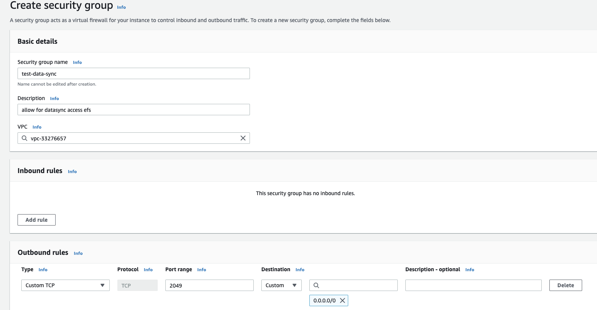

# 基于Datasync的跨账号EFS和S3同步

## 描述
本试验目的为在中国区使用Datasync进行数据在EFS和S3间同步数据，由于是AWS服务间进行数据同步，所以不涉及到data sync agent相关的安装

## 实验步骤

在本试验中，EFS所在账号为源账号，主要的操作基本都在该账号，另外S3所在账号为目的账号
* 配置源账号相应的角色，网络和对应的安全组
* 配置目的地s3及其相应权限
* 配置源locaition和目的location
* 验证结果


#### 前提条件
* EFS已经挂载到对应的试验机器上
* 试验机器中绑定的IAM用户有足够的权限，本试验中为demo_user
* 目的地s3已经生成，没有特殊配置
* 操作者同时具有源和目的的的admin权限
  > 如果没有可以参考，这里进行datasync单独的权限配置https://docs.aws.amazon.com/datasync/latest/userguide/permissions-requirements.html


#### 配置源账号
1. 配置datasync task所需要实用的运行时Role

    因为本试验中主要涉及到的为s3，所以除了基本的datasync权限以外，还需要配置s3的访问权限，具体权限如下所示
    
    同时，因为中国区还没有对应的trust relationship，所以我们需要在创建role的时候使用默认的EC2授权，然后再改成如下所示
   ```
   {
    "Version": "2012-10-17",
    "Statement": [
        {
            "Effect": "Allow",
            "Principal": {
                "Service": "datasync.amazonaws.com"
            },
            "Action": "sts:AssumeRole"
        }
    ]
   }
   ```
2. 配置datasync访问EFS所需要的安全组
   datasync service 使用EFS作为源时，本质上就是将其挂载到了datasync服务上，在后续的location配置中，需要对这个挂载点选择一个安全组进行绑定，因为EFS的访问端口为2049，故配置如下
   
   > 更多配置参考https://docs.aws.amazon.com/datasync/latest/userguide/create-efs-location.html

#### 配置目的s3及其相应的权限
本试验中，因为在生成s3 location和datasync实际工作中都会用到跨账号的访问，所以此处需要配置如下
```
{
    "Version": "2012-10-17",
    "Statement": [
        {
            "Effect": "Allow",
            "Principal": {
                "AWS": "arn:aws-cn:iam::111222333444:user/demo_test"
            },
            "Action": [
                "s3:GetBucketLocation",
                "s3:ListBucket",
                "s3:ListBucketMultipartUploads"
            ],
            "Resource": "arn:aws-cn:s3:::cross-account-demo"
        },
        {
            "Effect": "Allow",
            "Principal": {
                "AWS": "arn:aws-cn:iam::111222333444:user/demo_test"
            },
            "Action": [
                "s3:AbortMultipartUpload",
                "s3:DeleteObject",
                "s3:GetObject",
                "s3:ListMultipartUploadParts",
                "s3:PutObjectTagging",
                "s3:GetObjectTagging",
                "s3:PutObject"
            ],
            "Resource": "arn:aws-cn:s3:::cross-account-demo/*"
        },
        {
            "Effect": "Allow",
            "Principal": {
                "AWS": "arn:aws-cn:iam::111222333444:role/datasync-transfer-role"
            },
            "Action": [
                "s3:GetBucketLocation",
                "s3:ListBucket",
                "s3:ListBucketMultipartUploads"
            ],
            "Resource": "arn:aws-cn:s3:::cross-account-demo"
        },
        {
            "Effect": "Allow",
            "Principal": {
                "AWS": "arn:aws-cn:iam::111222333444:role/datasync-transfer-role"
            },
            "Action": [
                "s3:AbortMultipartUpload",
                "s3:DeleteObject",
                "s3:GetObject",
                "s3:ListMultipartUploadParts",
                "s3:PutObjectTagging",
                "s3:GetObjectTagging",
                "s3:PutObject"
            ],
            "Resource": "arn:aws-cn:s3:::cross-account-demo/*"
        }
    ]
}
```
> role和user一定要分开写，否则会报API错误
其中
* cross-account-demo 替换成目的地s3名字
* 111222333444 替换成源账号的account
* demo_test 替换成本试验中源账号的操作用户
* datasync-transfer-role 替换为上一步骤中源账号中的datasync运行时role


#### 配置datasync的目的location和源location

1. 配置目的location
   
   进入试验机器中，确保其绑定了demo_test用户权限（属于源账号），因为在console中**无法**直接配置跨账号的location，所以需要在命令行进行配置，对应的配置文件如下所示
   ```
    [ec2-user@ip-172-31-42-44 ~]$ cat input.template
    {
    "Subdirectory": "",
    "S3BucketArn": "arn:aws-cn:s3:::cross-account-demo",
    "S3StorageClass": "STANDARD",
    "S3Config": {
        "BucketAccessRoleArn": "arn:aws-cn:iam::111222333444:role/datasync-transfer-role"
    }
   ```
   执行生成location的命令
   ```
   aws datasync create-location-s3 --cli-input-json file://input.template --region cn-north-1
   ```
   此时在源账号的console中便会生成对应的location

2. 配置源location
   
   进入源账号的datasync界面，点击创建EFS类型的location，配置如下所示 
   
   其中
   * subent要为跟EFS在同一vpc的subnet
   * security group为在配置源账号时生成的安全组
  
#### 实验同步效果

登陆进源账号的试验机中，在挂载点写入一个测试文件，类似如下图所示
```
[ec2-user@ip-172-31-42-44 ~]$ cat efs/text.txt
123
```
进入源账号的datasync服务，点击创建task，选择我们之前创建好的源和目的location，配置完成后如下图所示

创建完毕后，点击task右上角的开始，点击start with default. 等待数分钟后，可以发现task的状态变成了available,点进右侧的last execution可以查看具体失败还是成功。同时查看目的S3，可以看到文件被成功同步


